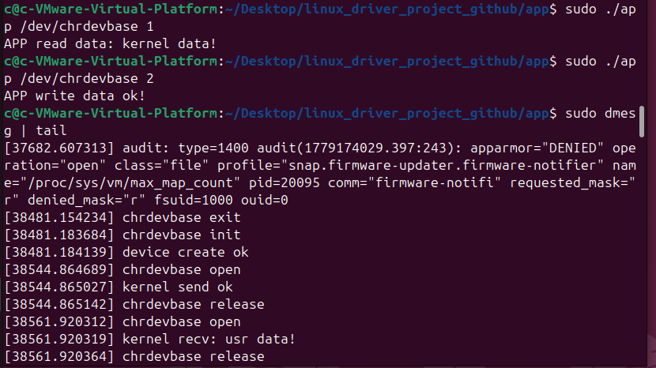

# Linux Driver Project

一个用于 BSP 和嵌入式 Linux 开发的个人 Linux 驱动程序学习项目。

## Project Structure

```text
linux_driver_project_github/
├── driver/
│   ├── basic_chrdev/
│   └── ioctl_demo/
├── user/
│   ├── app_basic/
│   └── app_ioctl/
├── docs/
├── screenshots/
├── README.md
└── .gitignore
Basic Character Device Driver

Features:

注册字符设备

自动创建设备节点

支持打开/读取/写入

用户空间测试应用程序

Build Driver

cd driver/basic_chrdev
make
Build APP
cd user/app_basic
gcc chrdevbaseAPP.c -o app
Run

sudo insmod chrdevbase.ko
sudo ./app /dev/chrdevbase 1
sudo ./app /dev/chrdevbase 2

---

# Load Driver

```bash
sudo insmod chrdevbase.ko
```

---

# Check Device

```bash
ls /dev/chrdevbase
```

---

# Build APP

```bash
cd app
gcc chrdevbaseAPP.c -o app
```

---

# Test Read

```bash
sudo ./app /dev/chrdevbase 1
```

---

# Test Write

```bash
sudo ./app /dev/chrdevbase 2
```

---

# Kernel Log

```bash
sudo dmesg | tail
```

---

# Communication Flow

APP -> system call -> VFS -> driver -> kernel buffer

---

# Environment

- Ubuntu 24.04
- Linux Kernel 6.x
- GCC 13

---

# Future Work

- ioctl
- cdev
- GPIO driver
- platform driver
- device tree

---
## Demo Result



# Author

Cerole